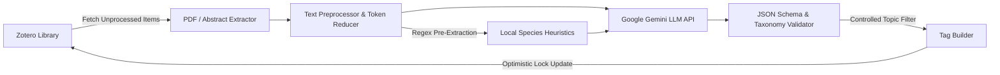

# Zotero AI Tagger

[](https://golang.org)
[](https://ai.google.dev)
[](docker/Dockerfile)
[](LICENSE)

An automated, high-performance CLI tool that categorizes and tags academic literature in **Zotero** libraries using Google Gemini large language models.

By integrating PDF full-text extraction, rule-based text reduction heuristics (70–80% token savings), zero-token local biological entity pre-extraction, and Google GenAI SDK endpoints (defaulting to `gemini-3.5-flash-lite`), `zotero-tagger` delivers standardized, hierarchical, and controlled taxonomy tags back into your Zotero database with full idempotency and concurrency.

---

## Key Features

- **Direct Zotero REST API Sync**: Seamlessly processes user libraries or shared group libraries with automatic pagination, exponential backoff, and HTTP 412 optimistic locking prevention.
- **Intelligent Full-Text Extraction**: Automatically downloads and parses attached PDF files using `pdftotext` (poppler-utils), with graceful fallback to item abstract notes.
- **70–80% Token Optimization**:
  - Strips parenthetical and bracketed academic citations.
  - Truncates bibliographies, reference lists, and appendix sections.
  - Prioritizes core scientific sections according to IMRAD hierarchy (Abstract &rarr; Conclusion &rarr; Introduction).
  - Enforces configurable token budgets to maximize LLM cost efficiency.
- **Zero-Token Local Entity Pre-Extraction**:
  - Scans raw text with optimized regular expressions for binomial nomenclature (e.g., *Escherichia coli*), genus notations (*Streptococcus sp.*), and taxonomic suffixes (*-aceae*, *-ales*, *-cocci*).
  - Feeds pre-extracted candidate entities as context hints to the LLM without additional token overhead.
- **Strict, Multi-Tiered Taxonomy Namespacing**:
  - `org:` &mdash; Standardized lowercase binomial species names (e.g., `org:streptococcus-mutans`). Excludes lab-tool cloning hosts and expression vectors unless they are the primary subject of research.
  - `group:` &mdash; Higher-level taxonomic clades, families, or phenotypic traits (e.g., `group:streptococcaceae`, `group:gram-negative`).
  - `topic:` &mdash; Controlled subject terms validated strictly against a user-defined vocabulary list to prevent taxonomy drift and hallucinated keywords.
- **Google GenAI Integration**: Uses the official Google GenAI SDK (`google.golang.org/genai`) defaulting to high-speed, cost-effective `gemini-3.5-flash-lite`.
- **Safety, Concurrency & Idempotency**:
  - Sentinel tagging (`_ai-tagged`) prevents duplicate processing on subsequent runs.
  - `--dry-run` mode provides rich terminal table previews without mutating your Zotero library.
  - Built-in multi-worker concurrency and token-aware rate limiting (RPM, TPM, RPD).
  - Local disk cache (`--cache`) to eliminate redundant LLM API calls during testing.
- **Container Ready**: Includes a multi-stage Docker build and Docker Compose configuration.

---

## Workflow Architecture



---

## Installation & Setup

### Prerequisites

- **Go 1.23+** (if building from source)
- **`poppler-utils`** (required for `pdftotext` PDF extraction):
  - **Debian / Ubuntu**: `sudo apt install poppler-utils`
  - **macOS** (Homebrew): `brew install poppler`
  - **Arch Linux**: `sudo pacman -S poppler`
  - **Alpine Linux**: `apk add poppler-utils`

### 1. Clone & Build

```bash
git clone https://github.com/andreassag/zotero-tagger.git
cd zotero-tagger
go build -o zotero-tagger ./cmd/zotero-tagger
```

### 2. Configure Environment Variables

Copy the example environment template:

```bash
cp .env.example .env
```

Edit `.env` with your API credentials:

```env
# Zotero API credentials
# Obtain your User ID and generate an API key at https://www.zotero.org/settings/keys
ZOTERO_USER_ID=12345678
ZOTERO_API_KEY=your_zotero_api_key

# Gemini API credentials
# Obtain your API key from Google AI Studio at https://aistudio.google.com/app/apikey
GEMINI_API_KEY=your_gemini_api_key
```

### 3. Customize `config/config.toml`

Adjust the configuration file to match your model, rate limits, and controlled topics:

```toml
[llm]
model_name = "gemini-3.5-flash-lite"
temperature = 0.0
max_input_tokens = 10000

[llm.rate_limits]
requests_per_minute = 1000
tokens_per_minute = 1000000
requests_per_day = 10000

[zotero]
library_type = "user" # "user" or "group"

[tagging.controlled_topics]
topics = [
    "oral microbiology",
    "biofilm",
    "quorum sensing",
    "antimicrobial resistance",
    "genomics",
    "metagenomics",
    "microbiome"
]
```

### 4. Git Hooks Configuration

Enable the repository's automated pre-commit quality checks:

```bash
git config core.hooksPath .githooks
```

The pre-commit hook automatically validates:
- Code formatting (`gofmt -s`)
- Static analysis (`go vet`)
- Linting (`golangci-lint` if installed)
- Unit test suite (`go test -short`)

---

## Usage

### Command-Line Reference

```bash
zotero-tagger tag [flags]
```

| Flag | Type | Default | Description |
| :--- | :--- | :--- | :--- |
| `--config` | `string` | `config/config.toml` | Path to TOML configuration file |
| `--dry-run` | `bool` | `false` | Preview generated tags without modifying Zotero items |
| `--limit` | `int` | `0` | Maximum number of items to process (`0` = all untagged) |
| `--collection` | `string` | `""` | Filter processing to a specific Zotero collection key |
| `--group` | `string` | `""` | Process a specific Zotero Group Library ID |
| `--item` | `string` | `""` | Process a single specific Zotero item key |
| `--concurrent` | `int` | `1` | Number of parallel worker threads |
| `--reprocess` | `bool` | `false` | Reprocess items even if the sentinel tag (`_ai-tagged`) exists |
| `--cache` | `bool` | `false` | Cache LLM prompt responses on disk to prevent redundant API calls |
| `--skip-llm` | `bool` | `false` | Run text extraction and reduction without invoking LLM or writing tags |
| `--verbose` | `bool` | `false` | Enable detailed debug logging |

---

### Examples

#### 1. Dry Run / Preview

Run a dry run on 5 items to preview generated tags and token reduction metrics in the terminal:

```bash
./zotero-tagger tag --dry-run --limit 5
```

#### 2. Process a Specific Item

Tag a single library item by its Zotero key:

```bash
./zotero-tagger tag --item ITEM_KEY
```

#### 3. Process a Collection with Concurrency

Process items within a specific collection using 4 concurrent workers:

```bash
./zotero-tagger tag --collection COLLECTION_KEY --concurrent 4
```

#### 4. Process a Shared Group Library

Process papers in a shared Zotero group library:

```bash
./zotero-tagger tag --group GROUP_ID
```

#### 5. Force Reprocessing of Previously Tagged Items

Refresh tags across all papers, bypassing the sentinel tag:

```bash
./zotero-tagger tag --reprocess
```

#### 6. Development & Inspection Mode

Test text reduction heuristics and inspect candidate species without calling the LLM API:

```bash
./zotero-tagger tag --skip-llm --limit 3 --verbose
```

---

## Running with Docker

`zotero-tagger` provides a lightweight Alpine container image with `poppler-utils` pre-installed.

### Using Docker Compose

1. Configure your `.env` and `config/config.toml` files.
2. Launch the containerized pipeline:

```bash
docker compose -f docker/docker-compose.yml up --build
```

### Using Docker CLI

```bash
# Build the image
docker build -t zotero-tagger -f docker/Dockerfile .

# Run dry run with local configuration mounted
docker run --rm \
  --env-file .env \
  -v $(pwd)/config/config.toml:/etc/zotero-tagger/config.toml:ro \
  zotero-tagger tag --dry-run --limit 5
```

---

## Detailed Documentation

For full architectural specifications, taxonomy schemas, model configuration, and troubleshooting guides, see the [Detailed Documentation Guide](docs/README.md).

---

## License

This project is licensed under the [MIT License](LICENSE).
