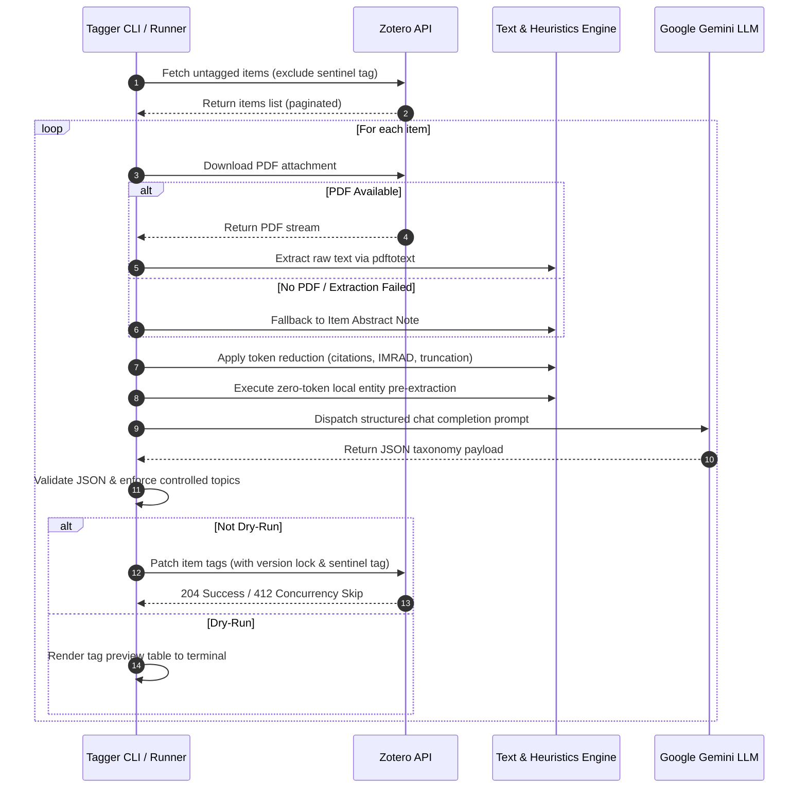

# Zotero AI Tagger &mdash; Technical Documentation & User Guide

A comprehensive guide for configuring, deploying, and extending `zotero-tagger`.

---

## Table of Contents

1. [Architecture & Pipeline Overview](#1-architecture--pipeline-overview)
2. [Configuration Reference (`config.toml`)](#2-configuration-reference-configtoml)
3. [Environment Variables (`.env`)](#3-environment-variables-env)
4. [Zotero API Setup](#4-zotero-api-setup)
5. [Google GenAI LLM Integration](#5-google-genai-llm-integration)
   - [Gemini API Setup](#gemini-api-setup)
   - [Model Requirements & Recommendations](#model-requirements--recommendations)
6. [Taxonomy & Tagging System](#6-taxonomy--tagging-system)
   - [Namespace Standards (`org:`, `group:`, `topic:`)](#namespace-standards-org-group-topic)
   - [Entity Pre-Extraction & Exclusion Rules](#entity-pre-extraction--exclusion-rules)
   - [Controlled Vocabularies & Domain Customization](#controlled-vocabularies--domain-customization)
   - [Sentinel Tag & Idempotency](#sentinel-tag--idempotency)
7. [Token Reduction & Optimization Engine](#7-token-reduction--optimization-engine)
8. [Performance, Rate Limiting & Caching](#8-performance-rate-limiting--caching)
9. [CLI Command & Flag Reference](#9-cli-command--flag-reference)
10. [Docker Deployment](#10-docker-deployment)
11. [Troubleshooting & FAQ](#11-troubleshooting--faq)

---

## 1. Architecture & Pipeline Overview

`zotero-tagger` automates the semantic analysis and tagging of academic literature stored in Zotero libraries. The execution pipeline follows an optimized, resilient sequence:



### Key Stages

1. **Item Discovery**: Queries user or group library for items matching allowed types (`journalArticle`, `conferencePaper`, `preprint`, `thesis`, `book`, etc.) that do not have the sentinel tag (`_ai-tagged`).
2. **Text Acquisition**: Attempts to download and extract full text from the highest-priority PDF attachment using `pdftotext`. If no PDF exists or extraction produces empty text, falls back to the Zotero abstract field.
3. **Text Reduction & Token Optimization**: Strips bibliographic citations, references, and appendices, prioritizing the most informative scientific sections (Abstract &rarr; Conclusion &rarr; Introduction).
4. **Local Regex Entity Pre-Extraction**: Scans text for Latin binomials, genus abbreviations, and clade suffixes. Detected entities are supplied as hints to the model without consuming significant context.
5. **Google GenAI LLM Prompting**: Prompts the Gemini model with structured taxonomy instructions and schema constraints. Supports optional disk caching for zero-token re-runs.
6. **Schema Validation & Topic Filtering**: Validates JSON response structure, normalizes namespace formatting, and discards any topic not present in the configured controlled vocabulary.
7. **Optimistic Version Lock & Sentinel Sync**: Appends formatted tags plus the sentinel tag (`_ai-tagged`) to the item in Zotero using HTTP optimistic locking (`If-Unmodified-Since-Version`).

---

## 2. Configuration Reference (`config.toml`)

The application configuration is managed via TOML. By default, the application looks for `config/config.toml` or the path specified by the `--config` flag.

```toml
[llm]
# Model identifier to specify in the API request
model_name = "gemini-3.5-flash-lite"

# Sampling temperature (0.0 recommended for deterministic, structured output)
temperature = 0.0

# Maximum token budget allocated for extracted paper text
max_input_tokens = 10000

[llm.rate_limits]
# Rate limiting controls
requests_per_minute = 1000
tokens_per_minute = 1000000
requests_per_day = 10000

[llm.retries]
# Maximum retry attempts on transient network or rate-limit failures
max_retries = 3
# Exponential backoff base factor (seconds)
backoff_base = 1.0

[zotero]
# Library type: "user" (default) or "group"
library_type = "user"

[zotero.retries]
max_retries = 3
backoff_base = 1.0

[zotero.item_types]
# List of Zotero item types eligible for processing
allowed = [
    "journalArticle",
    "conferencePaper",
    "preprint",
    "thesis",
    "book",
    "bookSection"
]

[processing]
# Preferred section priority order for text reduction
section_priority = ["abstract", "conclusion", "introduction"]
# Number of introductory paragraphs to retain when constructing prompt text
intro_paragraphs = 3

[tagging]
# Tag applied to items once processed to prevent redundant reprocessing
sentinel_tag = "_ai-tagged"

[tagging.controlled_topics]
# Authorized topic vocabulary. LLM topic outputs outside this list are discarded.
topics = [
    "oral microbiology",
    "biofilm",
    "quorum sensing",
    "antimicrobial resistance",
    "PCR",
    "genomics",
    "metagenomics",
    "microbiome",
    "pathogenesis",
    "virulence factors",
    "dental caries",
    "periodontal disease",
    "endodontics",
    "taxonomy",
    "phylogenetics",
    "clinical microbiology",
    "antibiotic susceptibility",
    "whole genome sequencing",
    "16S rRNA",
    "MALDI-TOF",
    "culture methods",
    "anaerobic microbiology",
    "polymicrobial infections",
    "host-microbe interactions",
    "immunology",
    "epidemiology",
    "public health",
    "food microbiology",
    "environmental microbiology",
    "bioinformatics",
    "machine learning",
    "proteomics",
    "metabolomics",
    "transcriptomics",
    "qPCR",
    "single cell rna seq",
    "comparative genomics",
    "horizontal gene transfer",
    "natural transformation",
    "bacterial persistence",
    "peptidoglycan",
    "outer membrane",
    "bacterial capsule",
    "pili fimbriae",
    "plasmids",
    "membrane vesicles",
    "gut microbiome",
    "dysbiosis",
    "commensalism",
    "opportunistic infection",
    "nosocomial infection",
    "immunocompromised host",
    "bacteriophage",
    "archaea",
    "mycobacteria",
    "fungal microbiome",
    "periodontitis",
    "gingivitis",
    "salivary glands",
    "gingival crevicular fluid",
    "oral mucosa",
    "periodontal ligament",
    "alveolar bone",
    "dental pulp",
    "dental plaque",
    "enamel dentin",
    "salivary flow rate",
    "osseointegration",
    "salivary mucin",
    "epithelial barrier",
    "mucosal immunity",
    "innate immunity",
    "adaptive immunity",
    "cytokine response",
    "inflammation",
    "extracellular matrix",
    "vascular permeability",
    "phagocytosis",
    "tissue remodeling",
    "gut brain axis",
    "endothelial dysfunction",
    "homeostasis",
    "cell adhesion",
    "reactive oxygen species",
    "neutrophil extracellular traps"
]
```

---

## 3. Environment Variables (`.env`)

Sensitive credentials and environment overrides should be placed in a `.env` file in the project root:

```env
# ------------------------------------------------------------------------------
# ZOTERO API CREDENTIALS
# ------------------------------------------------------------------------------
# Your numerical Zotero User ID (found in Zotero settings)
ZOTERO_USER_ID=12345678

# Your private Zotero API key with Read/Write permissions
ZOTERO_API_KEY=your_zotero_api_key_here

# ------------------------------------------------------------------------------
# GEMINI API CREDENTIALS
# ------------------------------------------------------------------------------
# API Key for Google Gemini (retrieve from https://aistudio.google.com/app/apikey)
GEMINI_API_KEY=your_gemini_api_key
```

> [!TIP]
> You can also supply these credentials via standard OS environment variables (e.g. `export GEMINI_API_KEY="..."`). The application will look for `.env` files automatically in the working directory or parent directories.

---

## 4. Zotero API Setup

### Step-by-Step Setup

1. **Log in to Zotero**: Go to [zotero.org](https://www.zotero.org) and sign in.
2. **Access Key Management**: Navigate to **Settings** &rarr; **Feeds/API** &rarr; **[Create new private key](https://www.zotero.org/settings/keys/new)**.
3. **Configure Permissions**:
   - **Key Description**: `Zotero AI Tagger`
   - **Personal Library**: Select **Allow library access** and **Allow write access**.
   - **Default Group Permissions**: If tagging group libraries, ensure **Read/Write** permissions are enabled for the target group(s).
4. **Save Key & Note User ID**:
   - Copy the generated API key (it will only be displayed once).
   - Your numerical **User ID** is shown at the top of the **Feeds/API** settings page (e.g., `Your userID for use in API calls is 12345678`).
5. **Populate `.env`**:
   ```env
   ZOTERO_USER_ID=12345678
   ZOTERO_API_KEY=your_generated_key
   ```

### Finding Group IDs and Collection Keys

- **Group Library ID**: When viewing a group library on zotero.org, the numerical ID is present in the URL (`zotero.org/groups/<group_id>/...`).
- **Collection Key**: Select the collection in the web library; the collection key appears in the URL (`zotero.org/users/<user_id>/collections/<collection_key>`).

---

## 5. Google GenAI LLM Integration

`zotero-tagger` uses the official Google GenAI Go SDK (`google.golang.org/genai`), communicating with Google's Gemini models for structured categorization.

### Gemini API Setup

In `config/config.toml`:

```toml
[llm]
model_name = "gemini-3.5-flash-lite"
temperature = 0.0
max_input_tokens = 10000
```

In `.env`:

```env
GEMINI_API_KEY=your_gemini_api_key
```

---

### Model Requirements & Recommendations

For optimal classification performance:
- **Default Recommendation**: `gemini-3.5-flash-lite` provides ultra-low latency, generous free-tier rate limits, and structured JSON output adherence.
- **Alternative Models**: `gemini-2.5-flash` or `gemini-2.5-pro` can be specified in `config/config.toml` if deeper scientific reasoning is required.
- **Temperature**: Keep `temperature = 0.0` to ensure strict, repeatable adherence to taxonomy formatting rules.
- **Context Length**: Gemini models provide 1M+ token context windows, allowing seamless processing of long academic articles and comprehensive taxonomy rules.

---

## 6. Taxonomy & Tagging System

### Namespace Standards (`org:`, `group:`, `topic:`)

The tagger enforces a 3-tier hierarchical taxonomy structure:

| Namespace | Example Tag | Description & Rules |
| :--- | :--- | :--- |
| `org:` | `org:streptococcus-mutans` | **Binomial Species Name**: Lowercase, hyphenated binomial format (`genus-species`). Identifies specific organisms central to the research. |
| `group:` | `group:streptococcaceae`<br>`group:gram-negative` | **Clade, Family, or Trait**: Higher taxonomic ranks, phenotypic attributes, or structural classifications. |
| `topic:` | `topic:biofilm`<br>`topic:quorum-sensing` | **Controlled Subject Topic**: Enforced strictly from the `[tagging.controlled_topics]` list in `config.toml`. |
| *Sentinel* | `_ai-tagged` | **Pipeline Sentinel**: Automatically attached to mark the item as successfully processed. |

---

### Entity Pre-Extraction & Exclusion Rules

#### Anti-Hallucination & Cloning Tool Exclusion
The system prompt contains a hard constraint for organism tagging:
> **Critical Rule**: Only tag organisms (`org:`) or groups (`group:`) that are the **primary subject** or core scientific focus of the paper. Routine laboratory cloning vectors, expression systems, or helper hosts (such as *Escherichia coli*, *Saccharomyces cerevisiae*, or cloning phages) are **excluded** if they are merely utilized as experimental methodology tools.

#### Local Regex Pre-Extraction
Before invoking the LLM, the local processor runs zero-token regex scanners to extract candidate entities:
- **Latin Binomials**: Captures capitalized genus followed by specific epithet (e.g., `Porphyromonas gingivalis`).
- **Genus Designations**: Captures genus notations (e.g., `Streptococcus sp.`, `Treponema spp.`).
- **Taxonomic Suffixes**: Identifies standard biological suffixes (`-aceae`, `-ales`, `-cocci`, `-bacilli`).

These candidates are passed to the model as pre-extracted hints, improving classification accuracy on specialized or less common organisms.

---

### Controlled Vocabularies & Domain Customization

To adapt `zotero-tagger` to another scientific discipline (e.g., oncology, materials science, neuroscience, ecology):

1. Open `config/config.toml`.
2. Replace the list under `[tagging.controlled_topics]` with your domain's standardized keywords:

```toml
[tagging.controlled_topics]
topics = [
    "immunotherapy",
    "checkpoint inhibitor",
    "tumor microenvironment",
    "metastasis",
    "CAR-T cell therapy",
    "neoantigen",
    "apoptosis",
    "angiogenesis"
]
```

3. If desired, adjust the system prompt description in [prompt.go](file:///home/andreassag/repo/zotero-tagger/internal/tagging/prompt.go) to match your domain's taxonomy conventions.

---

### Sentinel Tag & Idempotency

- When an item is processed, the sentinel tag (`_ai-tagged` by default) is written to Zotero alongside the extracted taxonomy tags.
- On subsequent runs, the fetch query excludes items already possessing this tag (`-tag:_ai-tagged`).
- To re-tag items after modifying prompt templates or topic vocabularies, run with `--reprocess`.

---

## 7. Token Reduction & Optimization Engine

Academic paper PDFs contain significant amounts of repetitive or peripheral text (author affiliations, reference lists, in-text citations, headers, footers). `zotero-tagger` reduces token consumption by **70% to 80%** using rule-based preprocessing:

```
+-------------------------------------------------------------+
|                  Raw PDF Full-Text (20k+ words)             |
+-------------------------------------------------------------+
                              |
                              v
 [ Citation Stripping: (Smith et al., 2020), [1-4], etc. ]
                              |
                              v
 [ Reference List & Bibliography Truncation (End of Paper) ]
                              |
                              v
 [ IMRAD Section Extraction & Prioritization ]
   Priority 1: Abstract & Concluding Summary
   Priority 2: Results & Key Findings
   Priority 3: First N Introductory Paragraphs
                              |
                              v
 [ Token Budget Clamping (max_input_tokens) ]
                              |
                              v
+-------------------------------------------------------------+
|              Optimized Prompt Text (~2k-3k words)           |
+-------------------------------------------------------------+
```

### Inspecting Token Savings

You can evaluate the token reduction engine on your library without sending API calls to the LLM:

```bash
./zotero-tagger tag --skip-llm --limit 5
```

Terminal output displays before-and-after word count statistics and percentage savings for each paper processed.

---

## 8. Performance, Rate Limiting & Caching

### Concurrency
Run multiple worker threads to accelerate bulk tagging of large libraries:

```bash
./zotero-tagger tag --concurrent 4
```

Worker routines are bound by internal semaphores, ensuring thread-safe processing and rate limit compliance.

### Token Bucket Rate Limiter
The built-in rate limiter monitors:
- **Requests Per Minute (RPM)**
- **Tokens Per Minute (TPM)** (estimated dynamically via word-count heuristics before dispatch)
- **Requests Per Day (RPD)**

If limits are approached, worker routines automatically pause until capacity is replenished.

### Local Disk Response Caching
Use `--cache` during development or configuration tuning:

```bash
./zotero-tagger tag --cache --dry-run
```

Responses are hashed based on the model name, system prompt, and user prompt (SHA-256) and saved in `.cache/llm/`. Identical requests are resolved instantly from disk at zero token cost.

---

## 9. CLI Command & Flag Reference

### `zotero-tagger tag`

Executes the synchronization pipeline.

```bash
./zotero-tagger tag [flags]
```

#### Flags

- `--config <path>`: TOML configuration file path (default: `config/config.toml`).
- `--dry-run`: Output generated tags and token savings to the terminal in formatted tables without updating Zotero.
- `--limit <int>`: Cap the number of items fetched and processed (`0` processes all eligible items).
- `--item <string>`: Target a single Zotero item by key (e.g., `--item 4A9K8M2Z`).
- `--collection <string>`: Filter items belonging to a specific Zotero collection key.
- `--group <string>`: Process a specific Zotero Group Library ID instead of the default personal library.
- `--concurrent <int>`: Parallel worker count (default: `1`).
- `--reprocess`: Process items even if the sentinel tag (`_ai-tagged`) is already present.
- `--cache`: Enable persistent disk caching for LLM requests.
- `--skip-llm`: Run extraction, preprocessing, and regex pre-extraction without calling LLM endpoints.
- `--verbose`: Enable debug-level log output.

---

## 10. Docker Deployment

### Dockerfile

The multi-stage [Dockerfile](file:///home/andreassag/repo/zotero-tagger/docker/Dockerfile) compiles a static Go binary on Alpine Linux and packages it with `poppler-utils` and `ca-certificates` in an ultra-compact ~25MB image.

### Running with Docker Compose

Mount your local configuration and environment file:

```yaml
# docker/docker-compose.yml
services:
  zotero-tagger:
    build:
      context: ..
      dockerfile: docker/Dockerfile
    env_file:
      - ../.env
    volumes:
      - ../config/config.toml:/etc/zotero-tagger/config.toml:ro
      - ../logs:/var/log/zotero-tagger
    command: ["tag", "--config", "/etc/zotero-tagger/config.toml"]
```

Execute:

```bash
docker compose -f docker/docker-compose.yml up --build
```

---

## 11. Troubleshooting & FAQ

### 1. `pdftotext: command not found` or PDF extraction failed
- **Cause**: The `poppler-utils` package is not installed on your system.
- **Fix**:
  - Ubuntu/Debian: `sudo apt install -y poppler-utils`
  - macOS: `brew install poppler`
  - When running via Docker, `poppler-utils` is installed automatically.

### 2. HTTP 412 Precondition Failed
- **Cause**: An item was modified in Zotero (via desktop client, web app, or another script) between the time `zotero-tagger` fetched it and attempted to update tags.
- **Behavior**: The tagger catches `412 Precondition Failed` and safely skips updating that item to prevent overwriting concurrent user edits.
- **Fix**: Re-run the tool; the item will be refreshed with the updated library version on the next sync.

### 3. HTTP 429 Too Many Requests
- **Cause**: Exceeded Zotero API or LLM endpoint request quotas.
- **Fix**: `zotero-tagger` automatically respects `Retry-After` headers and applies exponential backoff. For persistent limits, lower `requests_per_minute` and `tokens_per_minute` in `config/config.toml`.

### 4. Item has no PDF and no Abstract
- **Cause**: A Zotero metadata entry contains neither an attached PDF file nor an abstract text note.
- **Behavior**: The item cannot be categorized semantically and is safely skipped with a warning log.
- **Fix**: Add an abstract or attach a PDF to the item in Zotero.

### 5. LLM JSON Parsing Error
- **Cause**: The model returned non-JSON conversational text or malformed JSON.
- **Fix**:
  - Ensure `temperature = 0.0` in `config/config.toml`.
  - Use an instruction-tuned model designed for structured JSON completion.
